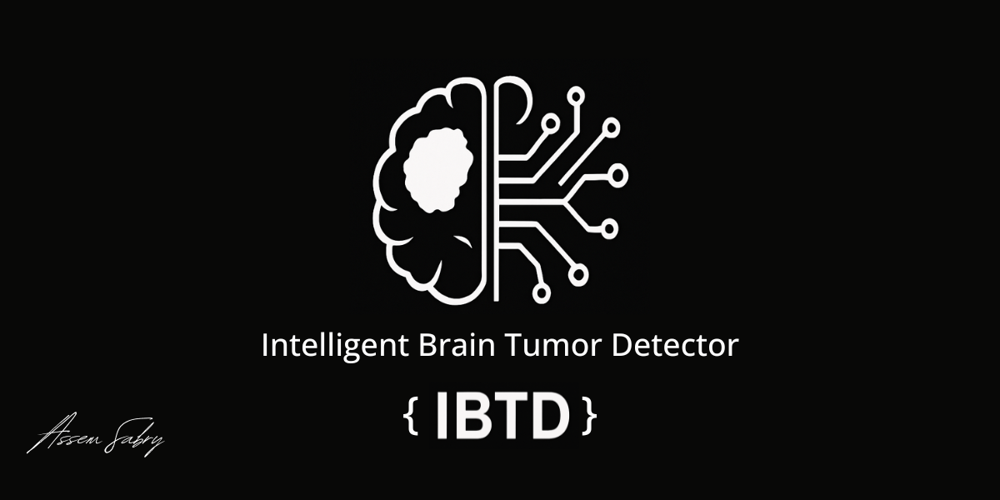
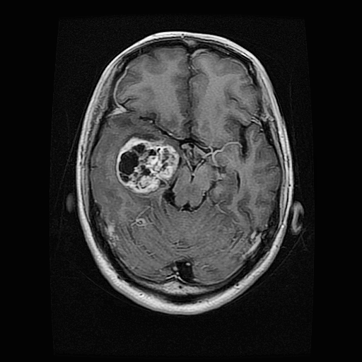
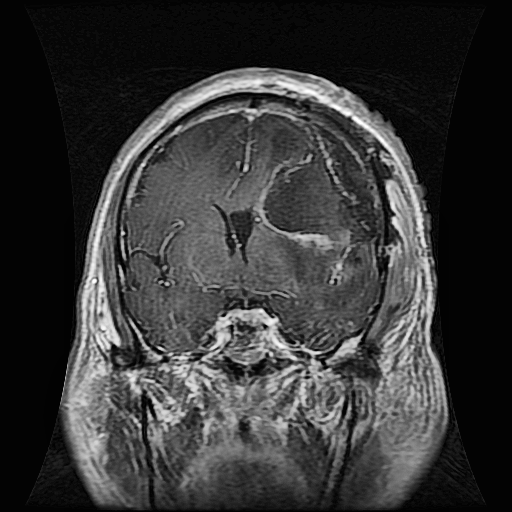
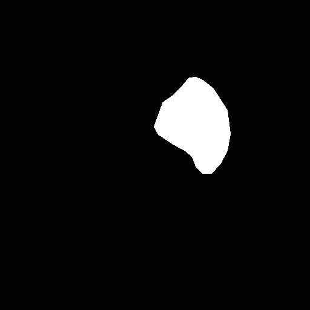
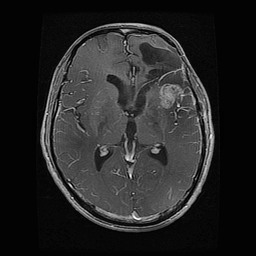
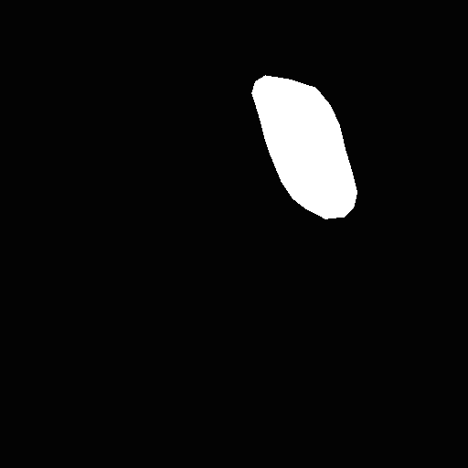
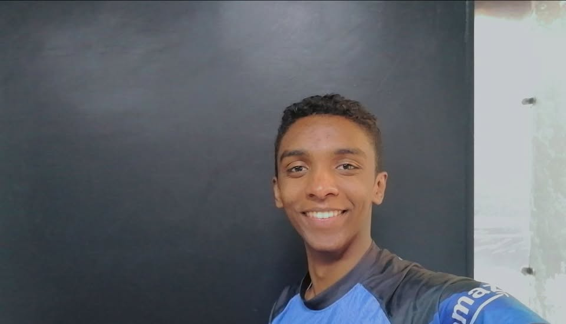

<p align="center">
  
</p>

# Intelligent Brain Tumor Detector (IBTD)

## Overview

The Intelligent Brain Tumor Detector (IBTD) is a deep learning-based classifier built to accurately detect and classify brain tumor types from MRI images. The model is trained using a fine-tuned ResNet50 architecture and leverages modern training techniques like data augmentation and MixUp regularization.

## Model Evaluation Report

The model was evaluated on a balanced test set containing four brain tumor categories: **GLIOMA**, **MENINGIOMA**, **NOTUMOR**, and **PITUITARY**.

### Classification Performance:

| Class      | Precision | Recall | F1-score | Support |
| ---------- | --------- | ------ | -------- | ------- |
| GLIOMA     | 99.65%    | 95.00% | 97.27%   | 300     |
| MENINGIOMA | 93.87%    | 95.10% | 94.48%   | 306     |
| NOTUMOR    | 99.26%    | 99.51% | 99.38%   | 405     |
| PITUITARY  | 96.44%    | 99.33% | 97.87%   | 300     |

**Overall Accuracy:** 98.41%

### Confusion Matrix:

```
               Predicted
            G     M     N     P
Actual G   285   15     0     0
       M     1  291     3    11
       N     0    2   403     0
       P     0    2     0   298
```

(G: GLIOMA, M: MENINGIOMA, N: NOTUMOR, P: PITUITARY)

##  Model Architecture

**Base Model:** ResNet50 (pretrained on ImageNet)  
**Frozen Layers:** All layers except the final block (`layer4`)

**Custom Head:**
- Global Average Pooling
- Fully Connected (Linear): `2048 → 4` (corresponding to the 4 tumor types)
- Activation: `Softmax` for multi-class classification

**Loss Function:** CrossEntropyLoss  
**Optimizer:** AdamW  
**Initial Learning Rate:** 1e-4  
**Learning Rate Scheduler:** ReduceLROnPlateau (mode='max', patience=3, factor=0.5)

**Training Strategy:**
- Mixup Data Augmentation (α = 0.4)
- 30 Epochs Total
- Batch Size: 32
- Validation Split: 15%
- Evaluation Metrics: Precision, Recall, F1-score, and Accuracy

##  Sample Data Examples

Here are three examples from the dataset showing the brain MRI alongside its tumor segmentation mask:

<table>
  <tr>
    <th>Sample</th>
    <th>Brain Image</th>
    <th>Tumor Mask</th>
  </tr>
  <tr>
    <td>Sample 1</td>
    <td></td>
    <td></td>
  </tr>
  <tr>
    <td>Sample 2</td>
    <td></td>
    <td></td>
  </tr>
  <tr>
    <td>Sample 3</td>
    <td></td>
    <td></td>
  </tr>
</table>

## Real-World Interpretation

If the model is used in a hospital setting to classify MRI scans for 100 patients:

* **On average, it will correctly diagnose about 97 to 98 patients.**
* The likelihood of misclassifying a tumor as another type is relatively low, especially for **NOTUMOR**, where the model achieves over 99% recall and precision.

### Example Use Case

A radiologist uploads an MRI image of a patient suspected of having a brain tumor:

* The IBTD model processes the image.
* It returns: `Class: PITUITARY` with a high confidence score.
* The radiologist uses this prediction to prioritize diagnosis and further testing.

## Model Details

* **Architecture:** ResNet50 (fine-tuned)
* **Training Set Size:** 4856 images
* **Validation Set Size:** 856 images
* **Epochs Trained:** 30
* **Data Augmentation:** Rotation, flipping, affine transforms, color jitter
* **Regularization:** MixUp

## Developer & Project Owner

<p align="center">
  
</p>

**Assem Sabry** is a 17-year-old Egyptian AI Engineer.  
He has authored several research projects in the fields of **medical AI** and **artificial intelligence** in general.  
This project was entirely designed, developed, and trained by **Assem Sabry** himself, with no external contributions.

All rights to this project are reserved and owned solely by **Assem Sabry**.  
The entire development process — including data handling, modeling, and evaluation — was conducted individually.

---

-  Website: [https://assemsabry.netlify.app/](https://assemsabry.netlify.app/)  
-  Email: assemsabryyy@gmail.com


## How to Use

1. **Clone the repository:**
```bash
git clone https://github.com/assemsabry/IBTD
cd IBTD
```

```bash
python -m venv venv
source venv/bin/activate     # On Linux/Mac
venv\Scripts\activate        # On Windows
```

```bash
pip install -r requirements.txt
```

```bash
python main.py
```

## Dependencies

- **Python** 3.13  
- **PyTorch**  
- **TorchVision**  
- **NumPy**  
- **Matplotlib**  
- **scikit-learn**  
- **TensorBoard**  
- **OpenCV**  
- **Pillow**


